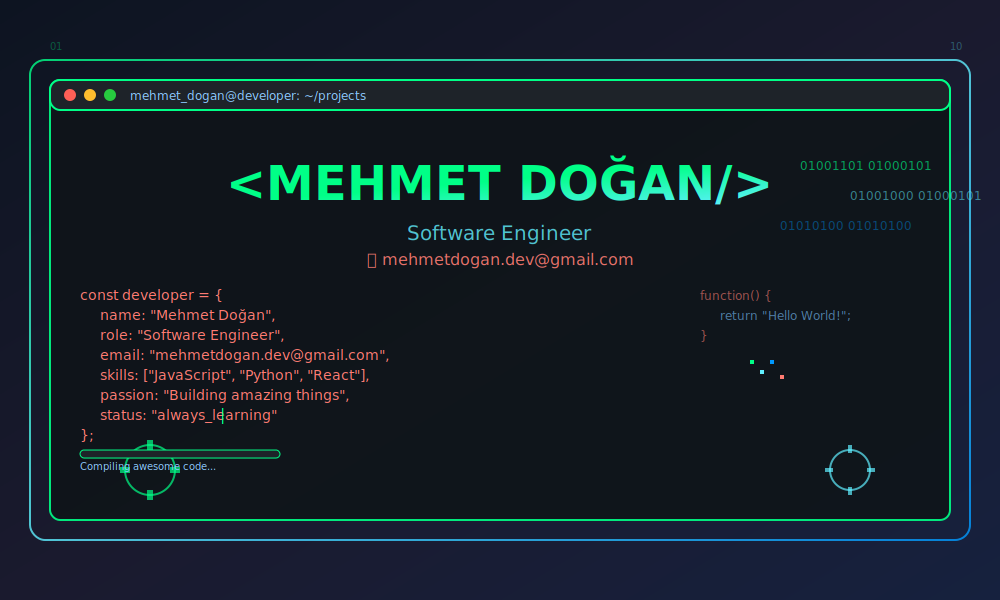
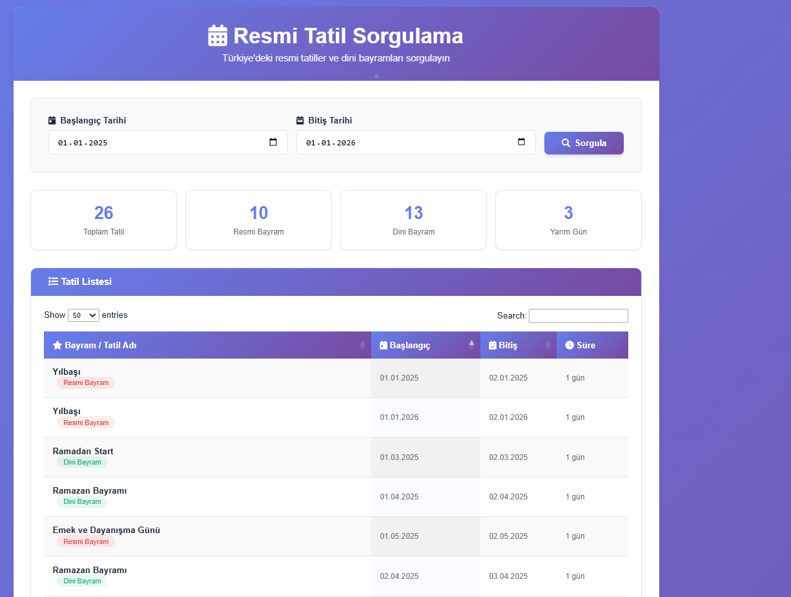
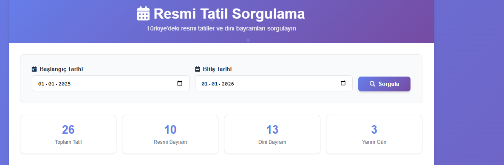

# 🇹🇷 Turkey Official Holidays Inquiry System



## 📋 İçindekiler
- [Genel Bakış](#-genel-bakış)
- [Özellikler](#-özellikler)
- [Teknolojiler](#-teknolojiler)
- [Kurulum](#-kurulum)
- [Kullanım](#-kullanım)
- [API Yapılandırması](#-api-yapılandırması)
- [Dosya Yapısı](#-dosya-yapısı)
- [Ekran Görüntüleri](#-ekran-görüntüleri)
- [Katkıda Bulunma](#-katkıda-bulunma)
- [Lisans](#-lisans)

## 🎯 Genel Bakış

**Turkey Official Holidays Inquiry System**, Türkiye'deki resmi tatiller ve dini bayramları sorgulayabileceğiniz modern bir web uygulamasıdır. Google Calendar API kullanarak güncel tatil bilgilerini çeker ve kullanıcı dostu bir arayüz ile sunar.

### 🌟 Ana Özellikler
- ✅ **Tarih Aralığı Sorgulama**: Belirli tarih aralığındaki tatilleri görüntüleme
- ✅ **Kategorize Edilmiş Tatiller**: Resmi bayramlar, dini bayramlar ve yarım gün tatilleri
- ✅ **İstatistiksel Görünüm**: Tatil türlerine göre sayısal analiz
- ✅ **Modern UI/UX**: Responsive tasarım ve güzel animasyonlar
- ✅ **Gerçek Zamanlı Veri**: Google Calendar API entegrasyonu
- ✅ **Gelişmiş Tablo**: DataTables ile arama, sıralama ve sayfalama

## 🛠 Teknolojiler

### Frontend


### Backend


### Kütüphaneler & API'ler
- **jQuery** - DOM manipülasyonu
- **DataTables** - Tablo işlevselliği
- **Font Awesome** - İkon seti
- **Google Calendar API** - Tatil verileri
- **CSS Grid & Flexbox** - Modern layout

## 🚀 Kurulum

### Gereksinimler
- PHP 7.4+
- Web sunucusu (Apache/Nginx)
- Google API Key
- Internet bağlantısı

### Adım Adım Kurulum

1. **Projeyi klonlayın:**
```bash
git clone https://github.com/mehmetdogandev/turkey-offical-holidays-Inquiry-system.git
cd turkey-offical-holidays-Inquiry-system
```

2. **Google API Key alın:**
   - [Google Cloud Console](https://console.cloud.google.com/)'a gidin
   - Yeni proje oluşturun veya mevcut projeyi seçin
   - Calendar API'yi etkinleştirin
   - API Key oluşturun

3. **API Key'i yapılandırın:**
```php
// get_holidays.php dosyasında
$apiKey = 'YOUR_GOOGLE_API_KEY'; // Buraya API Key'inizi yazın
```

4. **Web sunucusunda çalıştırın:**
```bash
# Apache/Nginx ile serve edin veya PHP built-in server kullanın
php -S localhost:8000
```

5. **Tarayıcıda açın:**
```
http://localhost:8000
```

## 💻 Kullanım

### Temel Kullanım
1. Tarayıcıda uygulamayı açın
2. **Başlangıç Tarihi** ve **Bitiş Tarihi** seçin
3. **"Sorgula"** butonuna tıklayın
4. Sonuçları tablo halinde görüntüleyin

### Gelişmiş Özellikler
- **Arama**: Tablo üzerindeki arama kutusunu kullanın
- **Sıralama**: Sütun başlıklarına tıklayarak sıralayın
- **Filtreleme**: Sayfa başına gösterilecek kayıt sayısını ayarlayın
- **İstatistikler**: Üst kısımdaki istatistik kartlarını inceleyin



## 🔧 API Yapılandırması

### Google Calendar API Ayarları
```php
$calendarId = 'turkish__tr@holiday.calendar.google.com'; // Türkiye takvimi ID'si
$apiKey = 'YOUR_GOOGLE_API_KEY'; // Google Cloud Console'dan alınan key
```

### API Endpoint
```
GET /get_holidays.php?start=YYYY-MM-DD&end=YYYY-MM-DD
```

**Örnek Response:**
```json
[
    {
        "summary": "Ramazan Bayramı",
        "start": "2025-03-30",
        "end": "2025-04-01"
    },
    {
        "summary": "Kurban Bayramı",
        "start": "2025-06-06",
        "end": "2025-06-10"
    }
]
```

## 📁 Dosya Yapısı

```
turkey-offical-holidays-Inquiry-system/
├── 📄 index.php                 # Ana sayfa (Frontend)
├── 📄 get_holidays.php          # API endpoint (Backend)
├── 📁 content/                  # Medya dosyaları
│   ├── 🖼️ banner.svg            # Ana banner
│   ├── 🖼️ dashboard.png        # Dashboard görüntüsü
│   ├── 🖼️ mobile-view.png      # Mobil görünüm
│   └── 🖼️ usage-example.png    # Kullanım örneği
└── 📄 README.md                # Dokümantasyon
```

## 📱 Ekran Görüntüleri

### Desktop Görünümü


### Mobil Görünümü


### Özellikler
- 🎨 **Modern Gradient Tasarım**
- 📱 **Tam Responsive**
- ⚡ **Hızlı Yükleme**
- 🔍 **Gelişmiş Arama**
- 📊 **İstatistiksel Analiz**
- 🎯 **Kullanıcı Dostu Arayüz**

## 🎨 Tasarım Özellikleri

### Renk Paleti
```css
:root {
    --primary-color: #667eea;      /* Ana renk */
    --secondary-color: #764ba2;    /* İkincil renk */
    --accent-color: #f093fb;       /* Vurgu rengi */
    --success-color: #10b981;      /* Başarı rengi */
    --warning-color: #f59e0b;      /* Uyarı rengi */
    --error-color: #ef4444;        /* Hata rengi */
}
```

### Responsive Breakpoints
- **Desktop**: 1200px+
- **Tablet**: 768px - 1199px
- **Mobile**: < 768px

## 🤝 Katkıda Bulunma

Projeye katkıda bulunmak isterseniz:

1. Fork edin
2. Feature branch oluşturun (`git checkout -b feature/amazing-feature`)
3. Değişikliklerinizi commit edin (`git commit -m 'Add some amazing feature'`)
4. Branch'inizi push edin (`git push origin feature/amazing-feature`)
5. Pull Request oluşturun

### Geliştirme Kuralları
- ✅ Kod standartlarına uyun
- ✅ Responsiveness'ı test edin
- ✅ Cross-browser uyumluluğunu kontrol edin
- ✅ Güvenlik açıklarını kontrol edin

## 🛡️ Güvenlik

- API Key'leri asla public repository'lerde paylaşmayın
- HTTPS kullanımını tercih edin
- Input validation uygulayın
- Rate limiting implementasyonu düşünün

## 📞 İletişim

**Mehmet Doğan**
- GitHub: [@mehmetdogandev](https://github.com/mehmetdogandev)
- LinkedIn: [Mehmet Doğan](https://linkedin.com/in/mehmetdogandev)
- Email: mehmet@example.com

## 📝 Lisans

Bu proje MIT lisansı altında lisanslanmıştır. Detaylar için `LICENSE` dosyasına bakın.

---

### 🎯 Gelecek Planları
- [ ] Çoklu dil desteği
- [ ] PWA (Progressive Web App) özelliği
- [ ] Dark/Light tema seçeneği
- [ ] Export (PDF/Excel) özelliği
- [ ] Push notification sistemi
- [ ] Gelişmiş filtreleme seçenekleri

---

⭐ **Projeyi beğendiyseniz yıldız vermeyi unutmayın!**


